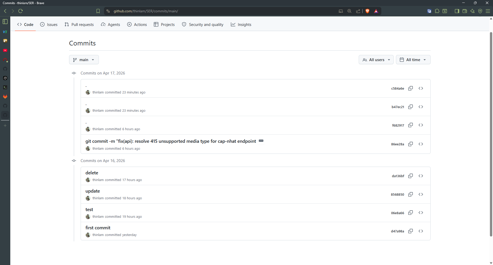
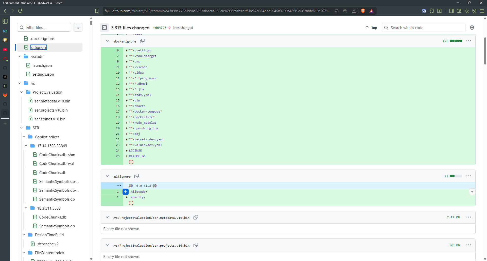
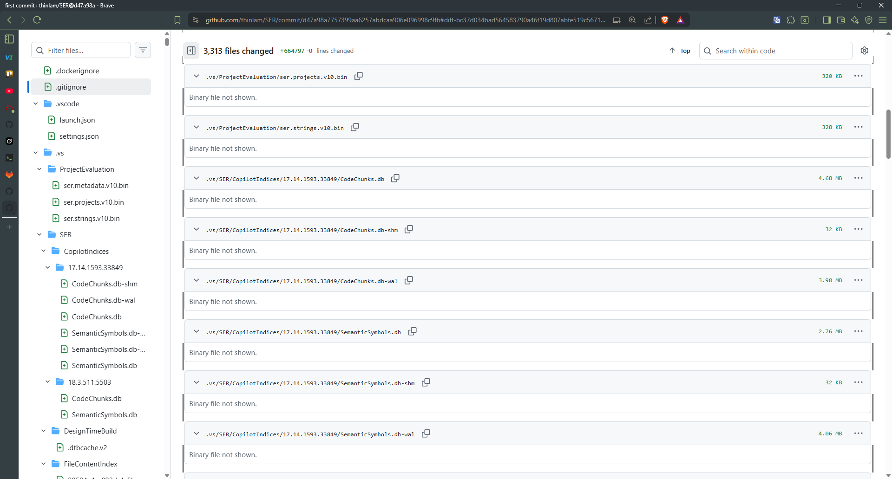
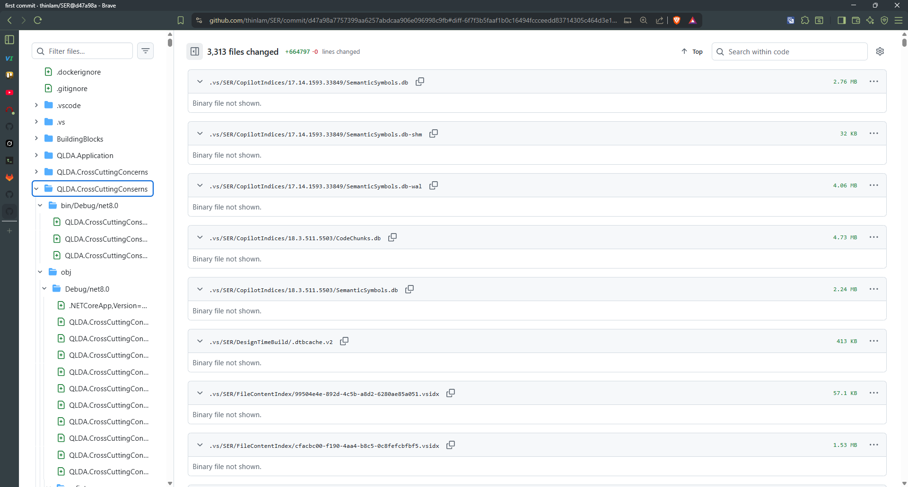
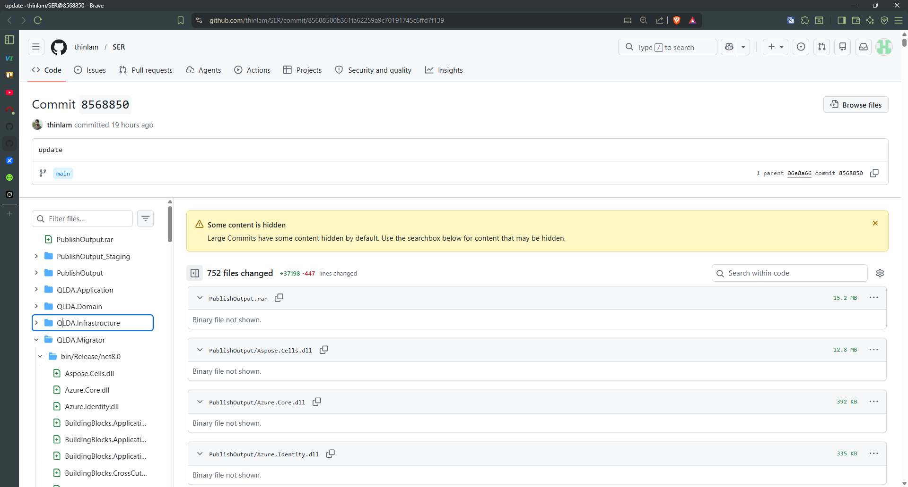
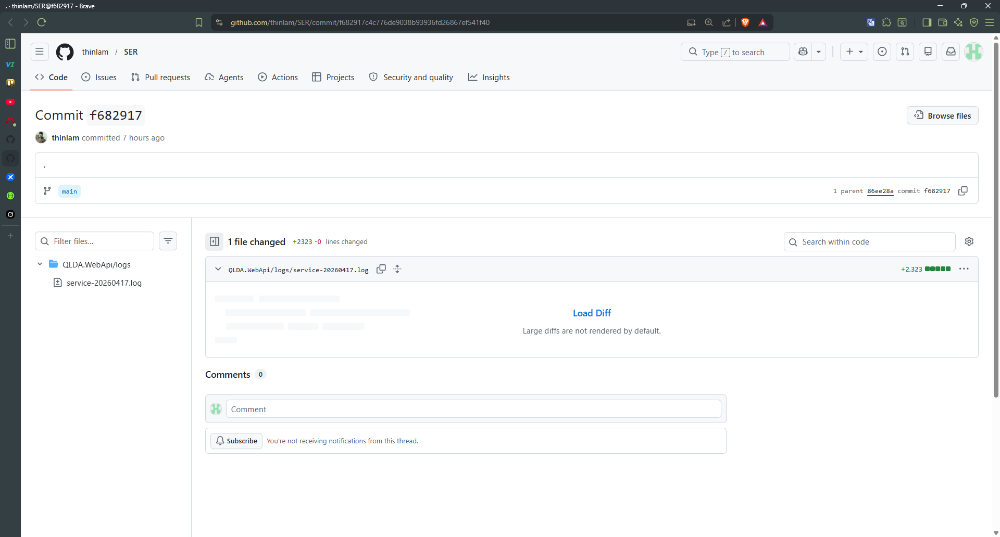

# Review Feedback - 17/04/2026

Chào em! Anh đã review qua code của em và thấy em đã có cố gắng tốt 👍 Tuy nhiên, có vài điểm cần lưu ý để cải thiện cho những project sau nhé. Anh sẽ giúp em hiểu rõ từng vấn đề và cách fix nhé!

---

## 1. Commit message chưa đúng format 📝



**Vấn đề:** Commit message em viết chưa theo chuẩn convention commits.

**Cách fix:** Commit message nên có format:
```
<type>: <mô tả ngắn gọn>
```

Các type phổ biến:
- `feat:` - thêm tính năng mới
- `fix:` - sửa bug
- `docs:` - cập nhật documentation
- `refactor:` - refactor code
- `test:` - thêm/sửa tests
- `chore:` - config, dependency, etc.

**Ví dụ đúng:**
```
feat: add user authentication endpoint
fix: resolve null pointer in login validation
docs: update API documentation for v2
```

**Tài liệu tham khảo:**
- [Conventional Commits](https://www.conventionalcommits.org/en/v1.0.0/)
- [Git Commit Best Practices](https://github.com/trein/dev-best-practices/wiki/Git-Commit-Best-Practices)

---

## 2. Thiếu .gitignore cho project .NET 🎯



**Vấn đề:** Em chưa tạo file `.gitignore` khi khởi tạo project .NET, dẫn đến việc push những file không cần thiết lên repo.

**Cách fix:** Tạo file `.gitignore` ngay khi init project! .NET có nhiều file/folder cần ignore như `bin/`, `obj/`, `.vs/`, logs, etc.

**Template .gitignore cho .NET:**
```gitignore
# Build results
[Dd]ebug/
[Dd]ebugPublic/
[Rr]elease/
[Rr]eleases/
x64/
x86/
[Ww][Ii][Nn]32/
[Aa][Rr][Mm]/
[Aa][Rr][Mm]64/
bld/
[Bb]in/
[Oo]bj/

# Visual Studio
.vs/
*.user
*.suo

# User-specific files
*.rsuser
*.suo
*.user
*.userosscache
*.sln.docstates

# Build logs
logs/
*.log

# Published files
publish/
```

**Tài liệu tham khảo:**
- [GitHub .gitignore templates for .NET](https://github.com/github/gitignore/blob/main/DotNET.gitignore)
- [Understanding .gitignore](https://git-scm.com/docs/gitignore)

---

## 3. Đừng push binary files! 🚫



**Vấn đề:** Binary files (`.dll`, `.exe`, `.pdb`, etc.) được push lên repo, làm repo nặng và khó manage.

**Tại sao không nên push binary files?**
- Repo becomes huge và clone slow
- Binary files không readable, không thể review diffs
- Cause merge conflicts khó resolve
- Generated files nên không cần store

**Cách fix:** Thêm vào `.gitignore`:
```gitignore
*.dll
*.exe
*.pdb
*.cache
```

---

## 4. Đừng push bin/ và obj/ folders 📦



**Vấn đề:** Tương tự #3, nhưng là entire folders instead of individual files.

**Cách fix:** Đã cover trong `.gitignore` template ở #2:
```gitignore
[Bb]in/
[Oo]bj/
```

**Lưu ý:** Những folder này được generate khi build, không cần push vì:
- Mỗi machine build sẽ tự generate
- Content varies between environments
- Làm repo size explode

---

## 5. Đừng push publish source 🚀



**Vấn đề:** Folder `publish/` chứa compiled output cho deployment, không nên trong repo.

**Cách fix:** Thêm vào `.gitignore`:
```gitignore
publish/
*.Publish.xml
```

**Lưu ý:** Deployment artifacts nên:
- Build từ CI/CD pipeline
- Store in artifact repository (nếu cần)
- NOT in source code repository

---

## 6. Đừng push logs! 📋



**Vấn đề:** Log files được push lên repo, chứa runtime data không cần trong source control.

**Cách fix:** Thêm vào `.gitignore`:
```gitignore
logs/
*.log
Log/
```

**Lưu ý:** Logs là:
- Runtime-generated data
- Environment-specific
- Should rotate và cleanup
- Có thể store in log aggregation service (ELK, CloudWatch, etc.)

---

## Summary & Best Practices 🌟

### Quick Checklist cho mỗi project mới:

1. **Tạo `.gitignore` FIRST** - trước khi commit bất cứ gì!
2. **Commit message theo convention** - dễ read, dễ track changes
3. **Review trước khi push** - check `git status` xem có file unwanted
4. **Keep repo clean** - only source code, configs, docs

### Tools helpful:

- `git status` - xem files trước commit
- `git reset HEAD <file>` - unstage unwanted files
- `.gitignore` generators: [gitignore.io](https://www.toptal.com/developers/gitignore)

---

**Anh biết em mới học, nên những mistake này là bình thường 😊** Quan trọng là em hiểu và fix for future projects. Có gì thắc mắc cứ hỏi anh nhé!

Happy coding! 💻✨